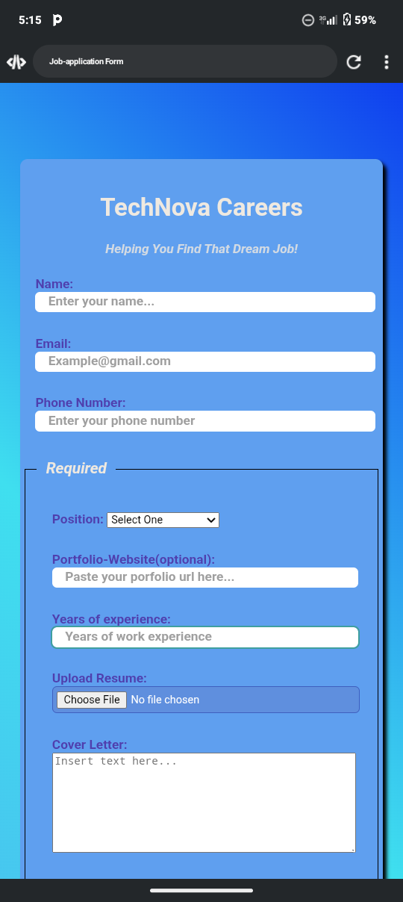

# Job Application Form

A simple, responsive job application form built using **HTML** and **CSS**.  
It allows users to fill out their personal details, upload resumes, and select preferred positions.

## 🧰 Technologies Used
- HTML5
- CSS3 (Gradient background, form styling, transitions)

## 🚀 Features
- Input validation
- Upload and date input fields
- Responsive layout
- Smooth button hover effect

## 📷 Preview

## 🔗 Live Demo
[View on GitHub Pages](https://benedictsamuel163-blip.github.io/job-application-form/)

## 👨‍💻 Author
**Ben (Scholar Junior)**  
*Aspiring Web Developer — Passionate about clean, creative code.*

---
